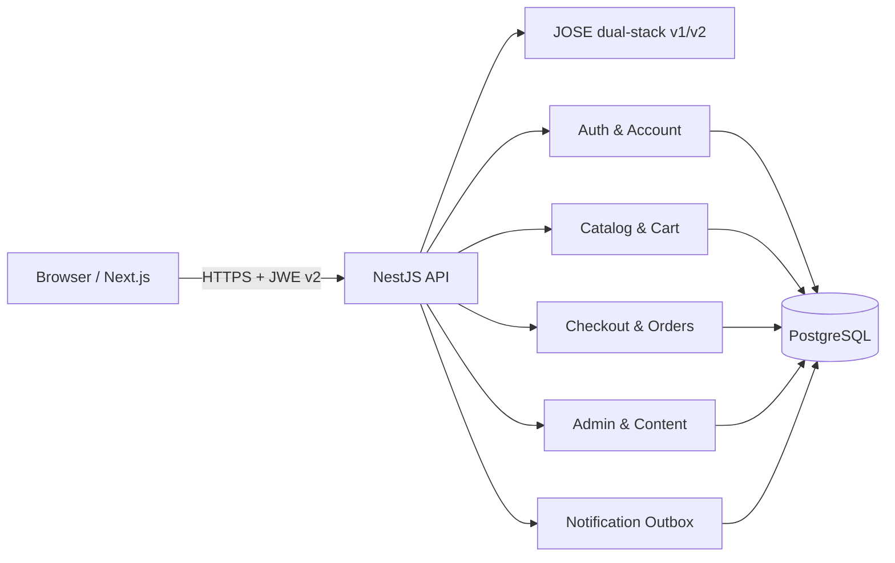
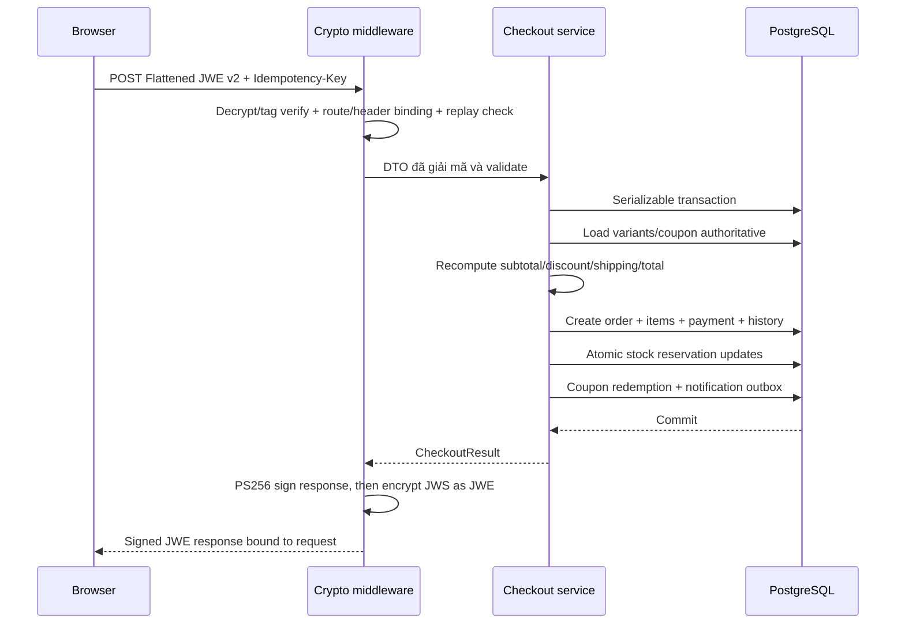

# Kiến trúc hệ thống

## Mục tiêu

MIRA Commerce là một **modular monolith**: deploy một API process nhưng giữ ranh giới module, contract và transaction rõ ràng. Kiến trúc này giảm độ phức tạp vận hành của microservices trong MVP, đồng thời vẫn cho phép tách module sau này.

## Sơ đồ thành phần

## Monorepo

- `apps/web`: App Router, server components cho catalog public và client components cho auth/cart/checkout/admin.
- `apps/api`: NestJS modules; Prisma là persistence adapter.
- `packages/contracts`: type giao tiếp dùng chung, không chứa persistence model.
- `packages/domain`: pricing và order state machine thuần TypeScript, test không cần DB.
- `packages/crypto-envelope`: JWE/JWS profile, legacy v1 và `SecureApiClient` dùng Web Crypto trong browser/Node.js.

## Ranh giới module API

| Module          | Trách nhiệm                                                    |
| --------------- | -------------------------------------------------------------- |
| `auth`          | Đăng ký/đăng nhập, session, refresh rotation, reset password   |
| `account`       | Hồ sơ, địa chỉ, đổi mật khẩu                                   |
| `catalog`       | Search/filter/detail và projection sản phẩm                    |
| `cart`          | Cart đã đăng nhập và kiểm tra tồn khả dụng                     |
| `checkout`      | Quote, pricing authoritative, coupon, idempotency, reservation |
| `orders`        | Tra cứu, state transition, cancel/return/refund flow           |
| `admin`         | Dashboard, product, inventory, customer, CMS, audit            |
| `content`       | Trang nội dung công khai                                       |
| `marketing`     | Newsletter subscriber                                          |
| `notifications` | Outbox để worker ngoài gửi email/SMS                           |

## Luồng checkout

## Quy tắc tồn kho

- `stock`: tồn vật lý hiện có.
- `reservedStock`: lượng đang giữ cho đơn chưa xác nhận.
- Tồn bán được: `stock - reservedStock`.
- Đặt đơn: tăng `reservedStock` bằng conditional update.
- Xác nhận: giảm đồng thời `stock` và `reservedStock`.
- Hủy trước xác nhận: giảm `reservedStock`.
- Hủy sau xác nhận nhưng trước giao: tăng lại `stock` theo state transition.
- Mọi thao tác tạo `InventoryMovement` để đối soát.

## Quy tắc tiền

- Tiền được lưu là số nguyên VND, không dùng floating point.
- Client không gửi đơn giá hoặc tổng tiền trong `CheckoutDto`.
- API load giá hiện hành từ `ProductVariant`, merge line trùng, kiểm tra tồn rồi tính lại.
- Coupon được kiểm tra thời gian, trạng thái, usage limit, per-user limit và min order trong transaction.

## Tính nhất quán

- Checkout dùng isolation `Serializable` và retry conflict có giới hạn.
- Unique constraint `(idempotencyScope, idempotencyKey)` bảo đảm một winner.
- Order status được kiểm tra bởi domain state machine.
- Lịch sử trạng thái lưu `fromStatus`, `toStatus`, actor, note, timestamp.

## Hướng tách service sau MVP

Tách theo nhu cầu tải và ownership, không tách chỉ vì số dòng code. Thứ tự hợp lý:

1. Notification worker/outbox processor.
2. Search/indexing nếu catalog lớn.
3. Payment orchestration khi tích hợp nhiều cổng.
4. Inventory/WMS nếu có nhiều kho.
5. Analytics pipeline.

Khi tách, dùng outbox/inbox và idempotent consumers; không thay transaction DB bằng distributed transaction đồng bộ.
